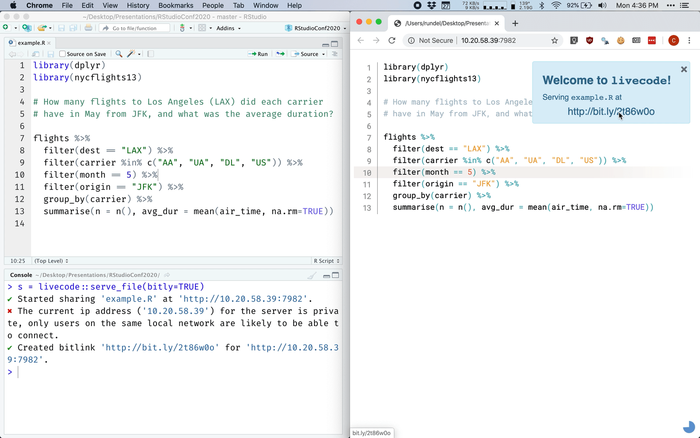

> *Note: This repository serves as a temporary replacement for the
> [original repo](https://github.com/rundel/livecode), which is
> currently unmaintained and contains some bugs. I’ve made a few fixes
> to suit my specific use case, but I do not plan to maintain this
> version long-term. This is intended as a workaround until the original
> author, or someone else, decides to create and maintain an updated
> version.*

# livecode 

<!-- badges: start -->

[](https://github.com/rundel/livecode/actions?query=workflow%3AR-CMD-check)

<!-- badges: end -->

<br/>

livecode is an R package that enables you to broadcast a local R (or any
other text) document over the web and provide live updates as it is
edited.

<br/>



## Installation

You can install the development version of `livecode` from this GitHub
repository:

``` r
remotes::install_github("JosephBARBIERDARNAL/livecode")
```

## Usage

``` r
# From RStudio with an open R script
server = livecode::serve_file()
#> ✔ Started sharing 'example.R' at 'http://192.168.1.128:30000'.
#> ✖ The current ip address ('192.168.1.128') for the server is private, only users on the same local network are likely to be able to connect.

# Once started, send messages to your users.
server$send_msg("Hello World!", type = "success")
server$send_msg("Oh no!\n\n Something bad has happened.", type = "error")

# Once finished, shut the server down.
server$stop()
#> ✔ Stopped server at 'http://192.168.1.128:30000'.
```

## Using bitly

`livecode` has built in functionality for generating a bitlink
automatically for your livecoding session. To do this you will need to
provide `livecode` with a bitly API access token. To obtain one of these
tokens you will need to create an account with bitly (the free tier is
sufficient) and then select <kbd>Profile Settings</kbd> \> <kbd>Generic
Access Token</kbd> and then enter your password when prompted. This
results in a long hexidecimal string that you should copy to your
clipboard.

`livecode` looks for this token in an environmental variable called
`BITLY_PAT`. To properly configure this environmental variable we can
use the `usethis` package. In R run the following,

``` r
usethis::edit_r_environ()
```

which will open your `.Renviron` file for you and you will just need to
add a single line with the format

    BITLY_PAT=0123456789abcdef0123456789abcdef01234567

replacing `0123456789abcdef0123456789abcdef01234567` with the
hexidecimal string you copied from bitly. After saving `.Renviron` you
will need to restart your R session and can then test that your token is
function correctly by running,

``` r
livecode::bitly_test_token()
#> ✔ Your bitly token is functioning correctly.
```
